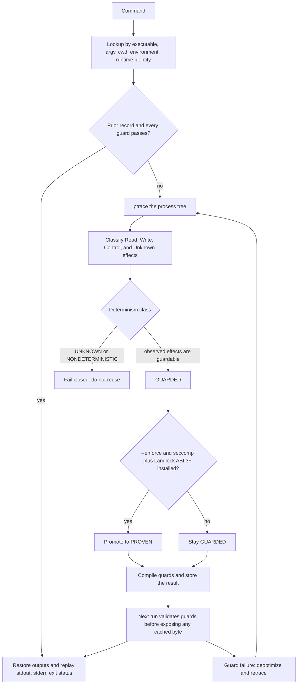

# Architecture

## Execution pipeline

~~~text
command
  |
cache candidate lookup
  |
guards
  |-- pass -> restore outputs and replay process result
  '-- fail
       |
      ptrace
       |
     effects
       |
 dependency reconstruction
       |
 classification
       |
 guard generation
       |
 persist in SQLite and CAS
~~~

The lookup key contains only information available before execution: executable
hash, argv, cwd, the inherited environment, and runtime identity. Input files are
not guessed into that key. They are discovered during tracing and become mandatory
guards on a candidate. All guards run before any cached byte is exposed.

## Workspace boundaries

- tracejit-effects owns structured effects, TraceIR, identities, dependency types,
  and the conservative classifier.
- tracejit-guards owns BLAKE3 hashing, fingerprints, canonical serialization,
  guard compilation, and synchronous validation.
- tracejit-cache owns SQLite metadata, content-addressed objects, atomic writes,
  output restoration, and corruption checks.
- tracejit-trace owns Linux x86_64 ptrace, process state, syscall decoding,
  per-process file descriptors, and normalized raw effects.
- tracejit-sandbox owns capability detection, seccomp-BPF, Landlock, and the
  enforcement result.
- tracejit-core owns lookup, guard, reuse, trace, classify, persist, and explain.
- tracejit-cli owns clap parsing and human or JSON presentation only.

TraceIR is intentionally narrow. It records execution metadata, process nodes,
normalized effect records, and dependency edges needed by classification, guards,
explanation, and caching. It is not a generic compiler framework.

## Tracing and file descriptors

V1 uses ptrace because it provides a direct, auditable process-tree implementation
without requiring a privileged daemon or eBPF deployment. The tracer follows fork,
vfork, clone, and exec events. Each process carries cwd and file descriptor state;
fork inherits it, dup copies it, and close removes it. Because V1 does not yet model
the shared cwd and file tables permitted by clone flags, observing clone forces
UNKNOWN rather than risking reuse. The tracer records semantic file acquisition at
open/stat time rather than every read byte.

Syscall attempts with no modeled safe meaning become UNKNOWN, including failed
attempts whose result could affect control flow. Failed filesystem lookups for
missing paths become absence guards. In enforced mode, a policy denial is recorded
and blocks PROVEN.

eBPF is deferred until the ptrace behavior and adversarial corpus establish a
reference implementation. It could lower overhead, but verifier constraints,
kernel variation, and event loss require a separate correctness design.

## Dependency and output reconstruction

File hashes and fingerprints are captured when an input is acquired, before a later
write can change it. A read before the first write remains an input dependency. A
read occurring only after the first write is output-local and does not become a
pre-execution guard. Delete and rename operations capture their path preconditions.
Executed binaries and runtimes are file dependencies.

Regular output files are stored in the CAS by BLAKE3 hash. Deletions are explicit
artifacts. Restoration uses a temporary file in the destination directory followed
by rename. Before any restoration, TraceJIT verifies every CAS object and checks
whether the original writable open permitted creation. Existing outputs must still
be writable regular files with a single hard link. Directories, symlinks, hard-linked
outputs, and special-file outputs are not safely restorable and force UNKNOWN or a
failed reuse attempt.

SQLite maps the pre-execution key to a serialized execution record. The same record
is also written under executions/<id>.json for inspection. CAS reads rehash every
object and fail closed on mismatch.

## Enforcement

seccomp filters syscall classes but cannot express path-level filesystem policy.
Landlock ABI 3 or newer supplies path confinement, including truncation, for
declared executable/runtime inputs and writable outputs. Both must apply
successfully before core can change a GUARDED classification to PROVEN.

An enforcement request without a prior dependency profile performs discovery and
cannot be PROVEN. With a valid guarded profile, TraceJIT validates the profile,
builds a sandbox policy, then executes inside it. Unsupported kernel features
downgrade the result rather than being treated as enforcement.

## Why whole-command caching comes first

Whole-command reuse has a small correctness surface: one identity, one guard set,
one captured result, and one atomic decision. Partial graph reuse requires stable
subprocess boundaries, intermediate effect ownership, and composition rules for
mutations. Those mechanisms are deferred until the V1 safety model is established.

## Pipeline

Input files are discovered during tracing. They are not part of the lookup key.
The inherited environment is part of that key even when the process never calls
`getenv`, because ptrace does not see userspace reads of the environment block.

## Effects the tracer does not record

Anonymous `mmap`, `brk`, `madvise`, and `futex` are process-internal. A file-backed
`MAP_SHARED` mapping that is writable, or that `mprotect` later makes writable,
is `UNKNOWN` and is not reused. `mremap` of a recorded file mapping is `UNKNOWN`.
Private and read-only file mappings stay internal; the earlier `open` is the
content dependency. A private store does not modify the file.

`Guard::NoUnexpectedEffects` is appended to compiled guard lists and always
validates. It does not rescan the process. Unmodeled effects are rejected by
classification before a reusable record is stored.
