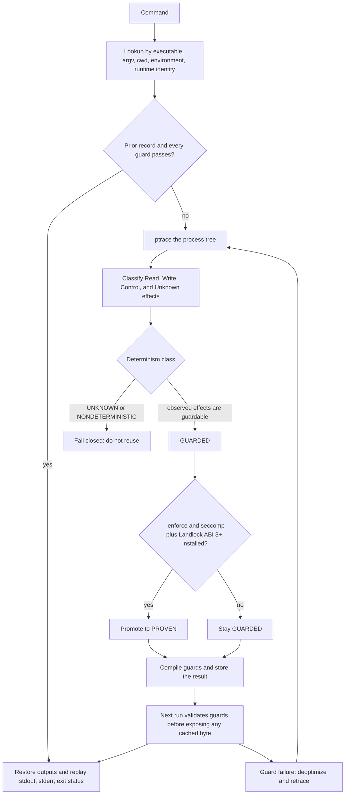

# TraceJIT

**Skip an unmodified Linux command when the dependencies it actually used still hold.**

TraceJIT watches a process, records the effects it can see, and reruns that command from cache only after every guard passes. If an effect is unknown, or the command reads the clock, randomness, or the network, TraceJIT runs it again.

Linux x86_64 only. It does not see a clock read that stays in the vDSO. A writable shared mapping of a file is refused, not replayed.

```bash
tracejit run -- ./benchmarks/workloads/c-transform/transform
```

On a GitHub-hosted Ubuntu 24.04 x86_64 runner, that synthetic workload went from **312.913 ms to 3.972 ms** (78.780x) at commit `e9684c1`. A shorter command on an earlier commit got **slower**: 7.396 ms became 7.957 ms. Both results are below.

## Try it

Linux x86_64. This tree is 0.1.1. The already published v0.1.0 binary does not contain this `explain` summary or these `doctor` sentences.

```bash
cargo build --workspace --release
./scripts/demo.sh
./target/release/tracejit doctor
```

`./scripts/install-dev.sh` installs from source. After v0.1.1 is published, `./scripts/install-release.sh` downloads that archive and checks `SHA256SUMS`. It exits if the release is missing. Do not point it at v0.1.0.

`tracejit doctor` says whether this machine can trace, whether seccomp and Landlock can support `PROVEN`, and where the cache will be written. On any other OS or architecture it exits non-zero and explains that reuse is unavailable.

## See it work

On Linux x86_64, from a checkout:

```bash
cargo build --workspace --release
./scripts/demo.sh
```

The script compiles the synthetic transform, runs it directly, traces it, reuses it, prints `tracejit explain`, appends one line to the input, and checks that the next run is `DEOPT` rather than a stale hit. It restores the input before exiting. Those timings are one execution each. The medians are in the table below.

`./scripts/demo.sh` talks to whatever `tracejit` is on `PATH` when `TRACEJIT` is set, and otherwise to `./target/release/tracejit`.

## Measured result

Both numbers came from the harness on GitHub-hosted Ubuntu 24.04 x86_64, with 5 warmups and 30 runs. They are not smoothed, and they are not production workloads.

| Workload | What it is | Baseline median | Cache-hit median | Speedup | Commit |
| --- | --- | ---: | ---: | ---: | --- |
| C transform | Fold `numbers.txt`, then 250,000,000 extra mix rounds | 312.913 ms | 3.972 ms | 78.780x | `e9684c1` |
| Short C ETL | Small CSV reduction with a fixed inner loop | 7.396 ms | 7.957 ms | 0.929468x | `63e3363` |

The later duration sweep, on the same class of runner after a hit-path change, lost at a 1.796 ms command and won at a 5.274 ms command (hit 4.100 ms, 1.286x). Cache hits in that run sat near 4 ms. A command that finishes sooner than the guard and cache work does not get faster.

Full tables, machine details, and the phase breakdown: [benchmarks/results/break-even.md](benchmarks/results/break-even.md) and [benchmarks/results/latest.md](benchmarks/results/latest.md). Reproduce with `./scripts/benchmark.sh` and `python3 benchmarks/harness/break_even.py --runs 30 --warmups 5` on Linux x86_64. Do not paste a new number into this file unless that harness wrote it for the stated commit.

## Why TraceJIT?

Make, Ninja, Bazel, Nix, and ccache reuse work when a person or a rule file listed the inputs. TraceJIT is for a command that is already built: it infers the dependencies it can observe and refuses reuse when it cannot. It does not replace those systems. A comparison is in [docs/COMPARISONS.md](docs/COMPARISONS.md).

## 30-second path after install

```text
tracejit doctor
tracejit run -- <command> [args...]
tracejit run -- <command> [args...]
tracejit explain
```

The first `run` traces. The second reuses only when the recorded class is `GUARDED` or `PROVEN` and every guard passes. `explain` prints the cache key, observed inputs, outputs, and guards. Environment values stay out of that summary; the cache itself can still hold them.

## How it works



Whole-command reuse. ptrace. BLAKE3 content addresses. SQLite metadata. Strict content hashing by default. No daemon.

1. Build a pre-execution identity from the executable, arguments, working directory, the entire inherited environment, and runtime identity. Input files are not guessed into that key.
2. Look up a prior execution and validate all of its guards.
3. On a hit, restore content-addressed outputs and replay the process result.
4. On a miss, trace the process tree, classify it, compile guards, and persist the result.
5. If a guard fails, record the reason and retrace.

## Safety model

False negatives recompute. That is acceptable. False positives return a stale result. That is not.

`UNKNOWN` and `NONDETERMINISTIC` never reuse. `EMPIRICALLY_STABLE` is not promoted automatically and does not reuse in V1. `PROVEN` means seccomp and Landlock were installed for that run. Observation alone never produces `PROVEN`.

| Class | Meaning | V1 reuse |
| --- | --- | --- |
| `PROVEN` | The run was `GUARDED`, then seccomp and Landlock ABI 3+ were both applied | yes |
| `GUARDED` | Observed dependencies have synchronous guards | yes |
| `EMPIRICALLY_STABLE` | Repetition without a structural argument | no |
| `UNKNOWN` | At least one attempted effect has no safe model | no |
| `NONDETERMINISTIC` | Clock, randomness, network, signals, unresolved IPC, or similar | no |

What that does and does not prove is written in [SAFETY.md](SAFETY.md). The short version: guards finish before cached stdout, stderr, exit status, or files are exposed. Another process can still change an input in the gap between the check and the restore. `PROVEN` narrows the traced process. It does not freeze the rest of the machine.

## Where it helps

- A deterministic Linux command you rerun unchanged, long enough that a few milliseconds of checking is smaller than the work.
- A command whose inputs are files, the executable, the working directory, and the inherited environment.
- A case you want to refuse rather than cache: clock, `getrandom`, network, threads that share address space, unmodeled syscalls.

## Where it does not help

- Commands shorter than the cache-hit floor. The published 7.396 ms ETL got slower.
- Python. CPython calls `getrandom` and `gettid`. TraceJIT refuses. There is no whitelist.
- Shell pipelines and `cc -c`. The published runs were `UNKNOWN` because of unmodeled syscalls and access checks.
- macOS, Windows, and non-x86_64 Linux.
- Partial reuse inside one process, remote caches, or anything TraceJIT cannot restore as a regular file.

## Performance

Cold tracing is slower than running the command directly. The published transform's value shows up on the later guarded hit, not on the first trace. The hit path still hashes inputs in the default strict mode, checks metadata, reads SQLite, and restores outputs. Phase medians for a short hit are in [benchmarks/results/break-even.md](benchmarks/results/break-even.md). A persistent daemon was not added: the safety checks stay on the hit path either way.

`--guard-mode fast` can skip a content hash when the fingerprint matches. It is experimental. Strict is the default because metadata is not content.

## Adversarial cases

`tests/fixtures/cases.json` is the expected classification list. The Linux integration test runs each case and compares eligibility. It covers changed file bytes and metadata, symlinks, environment, cwd, descendants, output mutation, clock, randomness, procfs, network, Unix sockets, ioctl, and process-result replay.

```bash
cargo test -p tracejit-cli --test linux_integration -- --nocapture
```

That test compiles only on Linux x86_64. The narrative for a naive cache versus TraceJIT is [docs/ADVERSARIAL.md](docs/ADVERSARIAL.md).

## Architecture

Effect types, guards, tracing, storage, sandboxing, orchestration, and the CLI are separate crates. Details, including the `mmap` limitation: [ARCHITECTURE.md](ARCHITECTURE.md). A schematic dependency picture: [docs/DEPENDENCY_GRAPH.md](docs/DEPENDENCY_GRAPH.md).

## Current limitations

- V1 reuses a whole command, not a subgraph.
- ptrace sees syscalls, not arbitrary userspace memory reads. vDSO can serve a clock with no syscall.
- Anonymous `mmap`, `brk`, and `futex` are process-internal. A writable shared file mapping is `UNKNOWN`. A clock read that stays in the vDSO is not seen.
- `clone` that shares file-descriptor or cwd state forces `UNKNOWN`.
- The guard named `NoUnexpectedEffects` always passes. Unmodeled effects are rejected during classification, before a reusable record exists. The guard does not rescan the process at reuse time.
- The cache stores stdout, stderr, environment, and output copies. It can hold secrets. It is not encrypted.
- These benchmarks are one synthetic CPU-bound transform and one small C ETL on ephemeral GitHub runners. They are not evidence about compilers, CI, or production jobs.

## CLI

```text
tracejit --version
tracejit doctor
tracejit run [--enforce] [--guard-mode strict|fast] [--verbose] [--json] -- <command> [args...]
tracejit analyze [--verbose] [--json] -- <command> [args...]
tracejit explain [execution-id] [--json]
tracejit cache stats
tracejit cache clear
```

`analyze` always executes and never reuses. `run` defaults to strict hashing. A refusal names the observation, for example `reuse disabled: process read randomness via getrandom`.

## Roadmap

Near-term work is more syscall coverage, especially the refusals already recorded for shell and `cc`, plus more workloads that are allowed to lose. Speculative execution, partial-graph reuse, and other operating systems are out of scope. See [ROADMAP.md](ROADMAP.md).

## Contributing

The useful bug is a command TraceJIT reuses when it should have rerun, or reruns when a guard was possible. Accepted safety bugs become fixtures. See [CONTRIBUTING.md](CONTRIBUTING.md). Security reports go to [SECURITY.md](SECURITY.md).

## FAQ

**Is the 78x number typical?** No. It is the median for one synthetic transform that burns about 313 ms of CPU and then hits a cache path near 4 ms. The same machinery lost on a 7 ms command.

**Why not strace plus a cache?** strace shows syscalls. It does not decide which effects are inputs, which writes are safe to replay, or when a later change must invalidate the result. TraceJIT's job is that decision, and the refusal when the decision is unsafe.

**What does `PROVEN` mean?** This run's observed effects were guardable, and both seccomp and Landlock ABI 3 or newer were applied to the process. It does not mean the result is formally verified, or that other processes cannot change a file underneath the check.

**What happens on an unsupported syscall?** The command is `UNKNOWN` and is not reused.

**Can I use this on macOS?** You can compile some of the workspace. `tracejit doctor` will fail, and `tracejit run` cannot trace. The product is Linux x86_64.

## License

TraceJIT is licensed under either of

- Apache License, Version 2.0 ([LICENSE-APACHE](LICENSE-APACHE))
- MIT license ([LICENSE-MIT](LICENSE-MIT))

at your option.
