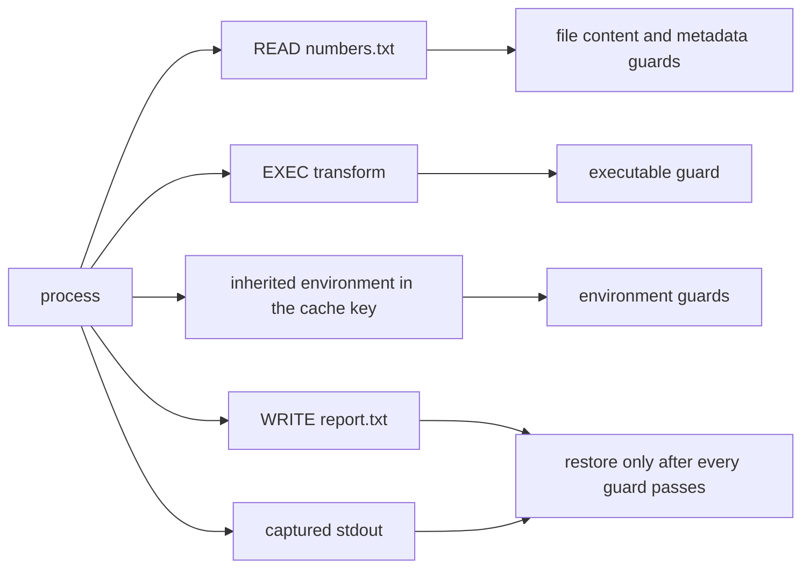

# Dependency graph

`tracejit explain` in 0.1.1 prints the recorded cache key, inputs, outputs, and guards. The published v0.1.0 binary still prints the older debug dump. The summary below is the 0.1.1 format. It is not a captured trace from the macOS checkout this documentation was edited on.

Environment values are omitted on purpose. The cache can still contain them.

## Schematic for the synthetic transform

This shape follows `benchmarks/workloads/c-transform/main.c`. It is not a substitute for `tracejit explain` on Linux. The dynamic linker and libc will add more `READ` and `EXEC` lines on a real run.

```text
cache key      argv, cwd, executable hash, runtime identity, and all N inherited environment entries
observed inputs
  READ  benchmarks/workloads/c-transform/numbers.txt
  EXEC  benchmarks/workloads/c-transform/transform
outputs
  WRITE benchmarks/workloads/c-transform/output/report.txt
guards
  executable content .../transform
  file content .../numbers.txt
  file metadata .../numbers.txt
  working directory ...
  runtime identity
  environment key <each inherited key>
```

Stdout is replayed from the content-addressed capture. It is not a separate file guard.

Changing `numbers.txt` has to fail the file-content guard and produce `DEOPT`. `./scripts/demo.sh` checks that sequence on Linux x86_64.

## How an effect becomes a guard

| Observed effect | Becomes | Checked before reuse |
| --- | --- | --- |
| File read before the first write of that path | `READ` input | BLAKE3 content, and the fingerprint |
| Exec of a binary | `EXEC` input | Content hash |
| Metadata-only probe | `META` or `LSTAT` | Fingerprint |
| Symlink read | `LINK` | Recorded target |
| Inherited environment | Cache key, not a traced `getenv` | Every key and value |
| Working directory | Cache key and a guard | Path |
| Regular file write | `WRITE` output | Restored from the content-addressed blob, or not reused |
| Clock, `getrandom`, network, signal, unresolved IPC | `NONDETERMINISTIC` | No record is eligible |
| Unmodeled syscall, shared `clone`, `/proc/self` | `UNKNOWN` | No record is eligible |

Strict mode hashes file content. Fast mode may accept an unchanged fingerprint without hashing. Fast mode is experimental. The default is strict.


